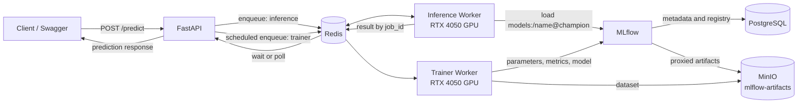

# WTN-A08: MLflow and Inference Worker

คู่มือนี้อธิบายระบบตั้งแต่การเทรนโมเดลเข้า MLflow Model Registry จนถึงการส่งข้อความให้ Inference Worker ทำนายผ่าน FastAPI และ Redis

## 1. Architecture



### หน้าที่ของแต่ละ service

| Service | หน้าที่ | Port/Queue |
|---|---|---|
| FastAPI | ตรวจ JWT, enqueue งาน และคืนผล | `8000` |
| Redis | เก็บคิวและผลลัพธ์ของ ARQ | `6379`; queues `trainer`, `inference` |
| PostgreSQL | เก็บ MLflow run metadata และ Model Registry | host `5433`, container `5432` |
| MinIO | เก็บ dataset, MLflow artifacts, model และ training log | API `9000`, console `9001` |
| MLflow | Tracking Server และ Model Registry | `5000` |
| Trainer Worker | เทรน token classification และ register model | queue `trainer` |
| Inference Worker | โหลด registered model แล้วทำนาย | queue `inference` |

MLflow ใช้ PostgreSQL เป็น backend store และใช้ MinIO bucket `mlflow-artifacts` เป็น artifact store แบบ proxy ดังนั้น Trainer และ Inference Worker ติดต่อ MLflow URL เดียว ไม่ต้องเปิด MinIO credentials ให้ client ภายนอก

## 2. ไฟล์สำคัญ

| ไฟล์ | รายละเอียด |
|---|---|
| `compose.yml` | ประกาศ WTN-A08 services, health checks, GPU และ volumes โดยคง Label Studio จากงานเดิมไว้ |
| `docker/api.Dockerfile` | สร้าง FastAPI image และ copy โค้ด `backend/` เข้า `/app/backend` |
| `docker/trainer.Dockerfile` | ใช้ PyTorch CUDA 13.0 image สำหรับ Trainer Worker |
| `docker/inference.Dockerfile` | ใช้ PyTorch CUDA 13.0 image สำหรับ Inference Worker |
| `docker/mlflow.Dockerfile` | ติดตั้ง MLflow, PostgreSQL driver และ S3 client |
| `backend/workers/tasks/train_token_classifier.py` | เทรน, log metrics, register model และตั้ง alias |
| `backend/workers/tasks/predict_token_classifier.py` | resolve alias, cache pipeline และทำนาย NER |
| `backend/services/inference_service.py` | enqueue, wait และอ่านผลจาก Redis ด้วย `job_id` |
| `backend/api/v1/inference/router.py` | ประกาศ inference APIs |

## 3. เตรียมเครื่อง

ต้องมี Docker Desktop, Docker Compose v2, NVIDIA driver และ NVIDIA Container Toolkit ที่ Docker Desktop ใช้งานได้ เครื่องนี้ใช้ RTX 4050 Laptop GPU 6 GB กับ image `pytorch/pytorch:2.13.0-cuda13.0-cudnn9-runtime`

```powershell
nvidia-smi
docker version
docker compose version
Copy-Item .env.example .env
notepad .env
```

แก้รหัสผ่าน placeholder ทุกตัว และห้าม commit `.env` เพราะมี credentials กับ JWT secret

## 4. ตรวจและ build containers

```powershell
docker compose -f compose.yml config --quiet
docker compose -f compose.yml build api mlflow trainer-worker inference-worker
```

- `-f compose.yml` เลือกไฟล์ Compose
- `build` สร้าง image จาก Dockerfile
- รายชื่อท้ายคำสั่งจำกัด service ที่ต้อง build
- ไม่ควรใช้ `--no-cache` ทุกครั้ง เพราะช้าและใช้พื้นที่มาก ใช้เมื่อสงสัยว่า layer cache เสียเท่านั้น

หาก build ล้มเหลวและต้องคืนพื้นที่ ให้ล้างเฉพาะ cache ที่ไม่ได้ใช้งาน:

```powershell
docker builder prune -f
```

อย่าใช้ `docker system prune --volumes` เพราะอาจลบ PostgreSQL, MinIO และ Redis data ของงานเดิม

## 5. Start และตรวจ health

```powershell
docker compose -f compose.yml up -d
docker compose -f compose.yml ps
docker compose -f compose.yml logs --tail=100 mlflow trainer-worker inference-worker api
Invoke-RestMethod http://localhost:8000/health/ready | ConvertTo-Json -Depth 4
```

`up -d` คือสร้างหรืออัปเดต container แล้วรันแบบ background ผล health ต้องเป็น `ok` สำหรับ `postgres`, `redis`, `minio` และ `mlflow`

ตรวจ GPU ภายใน workers:

```powershell
docker compose -f compose.yml exec -T trainer-worker python -c "import torch; print(torch.cuda.is_available(), torch.cuda.get_device_name(0), torch.version.cuda)"
docker compose -f compose.yml exec -T inference-worker python -c "import torch; print(torch.cuda.is_available(), torch.cuda.get_device_name(0), torch.version.cuda)"
```

`exec -T` รันคำสั่งใน container โดยไม่สร้าง pseudo-TTY เหมาะกับการเก็บ output หรือใช้ใน script

## 6. เตรียม dataset ใน MinIO

หากมี `training-datasets/datasets/conll2003/v1/conll2003.tar.gz` จาก WTN-A07 แล้ว ให้ข้ามขั้น upload ได้ ถ้ายังไม่มี:

```powershell
uv run --extra training python scripts/upload_dataset.py
```

Script จะดาวน์โหลด CoNLL-2003 จาก Hugging Face, save ด้วย `Dataset.save_to_disk()`, pack เป็น `.tar.gz` และ upload ไป MinIO โดย Trainer จะ download และ `load_from_disk()` ก่อนเทรน

## 7. Login และสร้าง access token

```powershell
$login = Invoke-RestMethod `
  -Uri "http://localhost:8000/api/v1/auth/login" `
  -Method Post `
  -ContentType "application/x-www-form-urlencoded" `
  -Body @{ username = "admin"; password = "รหัสผ่านในไฟล์ .env" }

$headers = @{ Authorization = "Bearer $($login.access_token)" }
```

หรือเปิด Swagger ที่ `http://localhost:8000/docs` แล้วใช้ปุ่ม **Authorize**

## 8. Retrain และ register model เข้า MLflow

`start_at` ต้องอยู่ในอนาคตและมี timezone ใช้ PowerShell สร้างเวลา UTC เพื่อลดปัญหา HTTP 422:

```powershell
$startAt = [DateTime]::UtcNow.AddSeconds(20).ToString("o")

$trainBody = @{
  dataset_name = "conll2003"
  dataset_bucket = "training-datasets"
  dataset_object = "datasets/conll2003/v1/conll2003.tar.gz"
  base_model = "bert-base-cased"
  model_name = "bert-conll2003-v1"
  start_at = $startAt
  epochs = 1
  batch_size = 4
  learning_rate = 0.00002
} | ConvertTo-Json

$trainJob = Invoke-RestMethod `
  -Uri "http://localhost:8000/api/v1/training/enqueue" `
  -Method Post `
  -Headers $headers `
  -ContentType "application/json" `
  -Body $trainBody

$trainJob | ConvertTo-Json
```

ติดตามด้วย `job_id`:

```powershell
Invoke-RestMethod `
  -Uri "http://localhost:8000/api/v1/training/status/$($trainJob.job_id)" `
  -Headers $headers | ConvertTo-Json -Depth 10
```

Trainer ทำงานตามลำดับนี้:

1. โหลด archive จาก MinIO
2. tokenize และ align `ner_tags`
3. เทรนและ evaluate บน GPU
4. บันทึก parameters, metrics, model และ log เป็น MLflow run
5. register เป็น model `bert-conll2003-v1`
6. ตั้ง alias `champion` ให้ version ล่าสุด
7. upload model copy ไป `trained-models/models/<model_name>/<UTC timestamp>/<job_id>/`
8. upload log ไป `training-logs/jobs/<job_id>/training.log`

เปิด `http://localhost:5000` แล้วตรวจ Experiment `token-classification`, run name ที่เท่ากับ training `job_id`, registered model `bert-conll2003-v1`, alias `champion` และ URI `models:/bert-conll2003-v1@champion`

## 9. Predict แบบ request/response

Endpoint นี้ enqueue เข้า Redis แล้วรอผลจาก Inference Worker สูงสุด 300 วินาที ครั้งแรกจะช้ากว่าเพราะต้องโหลด model จาก MLflow/MinIO

```powershell
$predictBody = @{
  text = "Hugging Face is based in New York City."
  model_name = "bert-conll2003-v1"
  model_alias = "champion"
  aggregation_strategy = "simple"
} | ConvertTo-Json

$prediction = Invoke-RestMethod `
  -Uri "http://localhost:8000/api/v1/inference/predict" `
  -Method Post `
  -Headers $headers `
  -ContentType "application/json" `
  -Body $predictBody

$prediction | ConvertTo-Json -Depth 10
```

ผลต้องมี `status: complete`, `success: true`, `model_uri`, `model_version`, `predictions`, `duration_ms` และ GPU ใน `device`

## 10. Predict แบบ asynchronous และดูผลด้วย job_id

```powershell
$inferenceJob = Invoke-RestMethod `
  -Uri "http://localhost:8000/api/v1/inference/enqueue" `
  -Method Post `
  -Headers $headers `
  -ContentType "application/json" `
  -Body $predictBody

Invoke-RestMethod `
  -Uri "http://localhost:8000/api/v1/inference/status/$($inferenceJob.job_id)" `
  -Headers $headers | ConvertTo-Json -Depth 10

Invoke-RestMethod `
  -Uri "http://localhost:8000/api/v1/inference/jobs" `
  -Headers $headers | ConvertTo-Json -Depth 10
```

## 11. หลักฐานสำหรับรายงาน

ควรถ่าย screenshot อย่างน้อย:

1. Diagram พร้อมลูกศร request, queue, load model และ response
2. `docker compose ps` ที่ services ทำงานครบ
3. `nvidia-smi` หรือคำสั่งตรวจ GPU ใน worker
4. MLflow experiment run ที่มี parameters และ metrics
5. MLflow registered model ที่เห็น alias `champion`
6. MinIO bucket `mlflow-artifacts`
7. Swagger response ของ `/inference/predict`
8. Swagger response ของ `/inference/status/{job_id}`

หากต้องการตรวจสอบการเทรน ให้เปิด system log จาก
`logs/training-logs/<training-job-id>.log` โดยตรง ไม่ต้องคัดลอกไปไว้ใน
`docs/evidence` และไม่ต้อง commit log เข้า GitHub จากนั้น commit เฉพาะ source
code, `compose.yml`, Dockerfiles, `uv.lock` และเอกสารนี้ โดยไม่ commit `.env`

## 12. Troubleshooting

- `start_at must be in the future`: สร้างค่าใหม่ด้วย `[DateTime]::UtcNow.AddSeconds(20).ToString("o")`
- model alias not found: ต้องมี successful MLflow training run และ alias `champion` ก่อน
- worker ไม่เห็น GPU: ตรวจ Docker Desktop Linux containers, NVIDIA driver และ `gpus: all`
- ดู logs: `docker compose -f compose.yml logs -f inference-worker mlflow`
- หยุดโดยเก็บ named volumes: `docker compose -f compose.yml down` โดยไม่ใส่ `-v`

## 13. ผลที่ตรวจสอบแล้วบนเครื่องนี้

ทดสอบเมื่อ 7 กันยายน 2026 บน NVIDIA GeForce RTX 4050 Laptop GPU 6 GB:

| รายการ | ผล |
|---|---|
| PyTorch / CUDA | `2.13.0+cu130` / `13.0` |
| Training job | `train-bert-conll2003-v1-20260907T070344Z-b9419f38` |
| MLflow run | `d547cc31e7c74ed3b4836f026c3ebf0c` |
| Registered model | `bert-conll2003-v1`, version `1`, alias `champion` |
| Evaluation F1 | `0.9370699781842591` |
| Evaluation accuracy | `0.9893501031891282` |
| Final inference job | `infer-20260907T072315Z-b3641287` |
| Final inference device | `NVIDIA GeForce RTX 4050 Laptop GPU (cuda:0)` |

System-generated training log จะถูกเขียนโดย Trainer Worker ลงใน
`logs/training-logs/<training-job-id>.log` โดยตรง และ upload สำเนาไปยัง
MinIO bucket `training-logs` ที่ object
`jobs/<training-job-id>/training.log` จึงไม่สร้างไฟล์ log ซ้ำในโฟลเดอร์เอกสาร
หรือ commit training log เข้า GitHub

## 14. References

- [MLflow Tracking Server architecture](https://mlflow.org/docs/latest/self-hosting/architecture/tracking-server/)
- [MLflow Artifact Store and S3-compatible storage](https://mlflow.org/docs/latest/self-hosting/architecture/artifact-store/)
- [MLflow Transformers flavor](https://mlflow.org/docs/latest/ml/deep-learning/transformers/guide/)
- [MLflow Model Registry tutorial](https://mlflow.org/docs/latest/ml/model-registry/tutorial)
- [Hugging Face token classification course](https://huggingface.co/learn/llm-course/en/chapter7/2)
